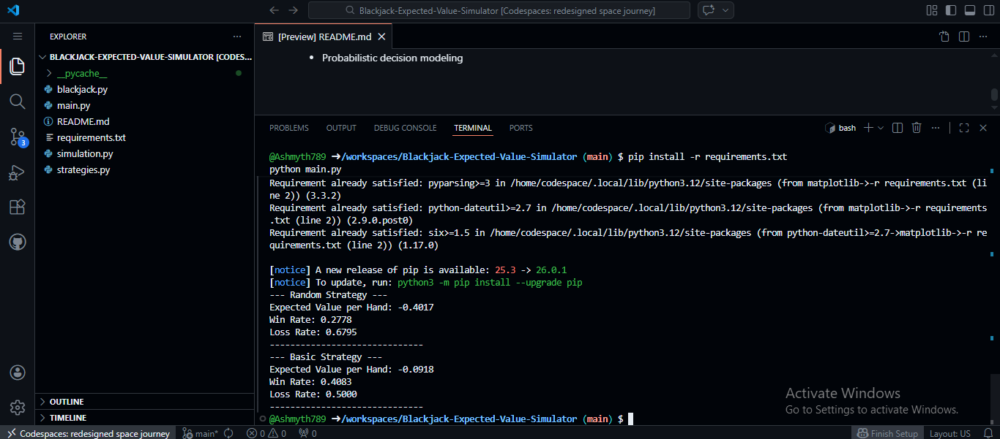

# Blackjack-Expected-Value-Simulator
This project models probabilistic decision-making under uncertainty using Monte Carlo simulation of Blackjack.
It compares:
- Random decision strategy
- Basic strategy (rule-based near-optimal play)

The objective is to analyze long-term profitability using expected value and variance dynamics.

📈Concepts Demonstrated
- Monte Carlo simulation
- Expected Value (EV)
- Variance vs Long-Term Convergence
- Risk-Reward asymmetry
- Probabilistic decision modeling

